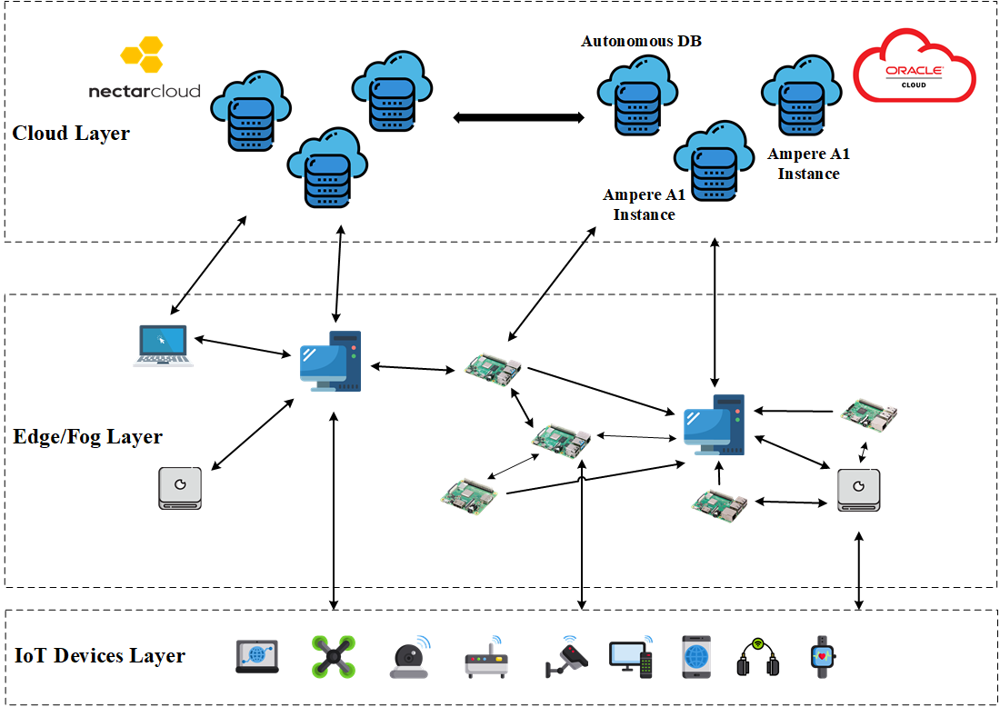

# FogBus2 Framework

# Abstract
FogBus2 as a new python-based framework, developed from scratch, offers a lightweight and distributed container-based framework for the integration of IoT-enabled systems with heterogeneous multi-cloud and multi-edge resources. Also, several IoT applications, ranging from AI-based applications (e.g., Face Detection) to small-sized games (e.g., GameOfLife) are implemented and integrated with this framework.

# Major Contributions
The major contributions of this work are as follow:
* A distributed containerized framework in python language that integrates IoT enabled systems, Edge/Fog, and Cloud infrastructure to support various types of IoT applications ranging from latency-critical to computation-intensive ones.
* Multi platform support. The docker image of framework's components and applications are built for different platroms, such as Intel, AMD, ARM, etc.
* Supporting different topology models for communication.
* Scheduling mechanism and several scheduling policies currently implemented and integrated with this framework.
* Dynamic scalability. There are some implemented mechanisms to dynamically scale the framework components based on the dynamics of the users' requests or the computing environment.
* Dynamic resource discovery.
* Dynamic profiling of resources and networking that are configurable.
* Automatic Virtual Private Network (VPN) support.
* Distributed multi-database platform support: The current version supports MariaDB and Oracle Autonomous Database.
* Performance evaluation of FogBus2 framework in terms of container startup time, average docker image size, runtime container RAM usage, response time of applications, etc.

# Developers
FogBus2 framework is developed by:
* Qifan Deng
* Mohammad Goudarzi
* Rajkumar Buyya

# Instructions to Install, Setup, Run, and Extend FogBus2 Framework and IoT Applications
To find an installation guideline, sample setup, VPN setup, Important protocols, running current features, extending the framwork, implementing and extending new IoT applications, please refer and cite to:
* [Book Chapter](https://arxiv.org/abs/2108.00591)

# Keywords
Internet of Things, Edge/Fog Computing, Containers Scheduling, Scalability

# Cite FogBus2 
## FogBus2 Main Paper
```
@inproceedings{deng2021fogbus2,
  title={FogBus2: a lightweight and distributed container-based framework for integration of IoT-enabled systems with edge and cloud computing},
  author={Deng, Qifan and Goudarzi, Mohammad and Buyya, Rajkumar},
  booktitle={Proceedings of the International Workshop on Big Data in Emergent Distributed Environments},
  pages={1--8},
  year={2021}
}
```
## Book Chapter
```
@article{goudarzi2021resource,
  title={Resource Management in Edge and Fog Computing using FogBus2 Framework},
  author={Goudarzi, Mohammad and Deng, Qifan and Buyya, Rajkumar},
  journal={arXiv preprint arXiv:2108.00591},
  year={2021}
}cita
```

# Other GuideLines
* prepare database. See [MariaDB Guide](docs/MariaDB.md#quick-start).

* Working with automatic demo script. It helps to build multi-arch images and run default applications of FogBus2 framework. To run demo script, see [Demo](docs/Demo.md#quick-start). 
 
 ## Automatic Scripts
|Script |Path|Usage|Guide|
|:-------------|:-------------|:-------------|:-------------|
|[MariaDB:10.5.9](https://hub.docker.com/_/mariadb)|[containers/database/mariadb/configure.py](containers/database/mariadb/configure.py)|`python3.9 configure.py -h`|[MariaDB](docs/MariaDB.md)|
|Demo|[demo/demo.py](demo/demo.py)|`python3.9 demo.py -h`|[Demo](docs/Demo.md)|
|[Wireguard](https://www.wireguard.com/)|[scripts/wireguard/generateConf.py](scripts/wireguard/generateConf.py)|*follow guide*|[Wireguard (VPN)](docs/Wireguard.md)|

## Docker Pull commands
To directly download all docker images to your instances or building docker images locally, please check [Prepare Docker Images](docs/PrepareDockerImages.md).

## Important Configs
See [Configs](docs/Configs.md) to understand how to modify configs. Includes,
- [Remote Logger Config](docs/Configs.md#remote-logger) 
- [Master Config](docs/Configs.md#master) 
- [Actor Config](docs/Configs.md#actor) 
- [Task Executor Config](docs/Configs.md#task-executor) 
- [User Config](docs/Configs.md#user) 
- [Hosts Config](docs/Configs.md#hosts-information) 
- [Wireguard Config](docs/Configs.md#wireguard-network)

# Sample Environment Architecture


# References
Coming Soon....
